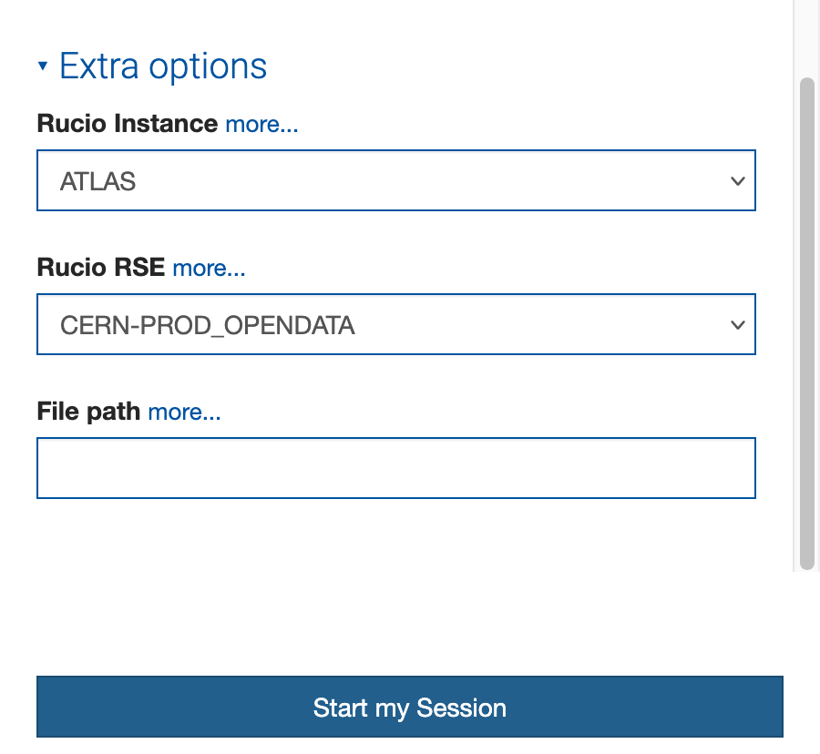

# Configure the SWAN session

In order to enable the Rucio JupyterLab extension in your SWAN session, you need to enable the experimental Juptyerlab option. 
Check the "Try the new JupyterLab interface (experimental)" box when launching your SWAN session.

Then, at the very end of the menu, you will find the "Extra options" section. 
Here, select the desired Rucio instance, and the corresponding Rucio Storage Element (RSE) to be used as local stoage for the files.

Finally, launch the SWAN session. Once the JupyterLab interface is loaded, you should see the Rucio extension icon on the left sidebar.