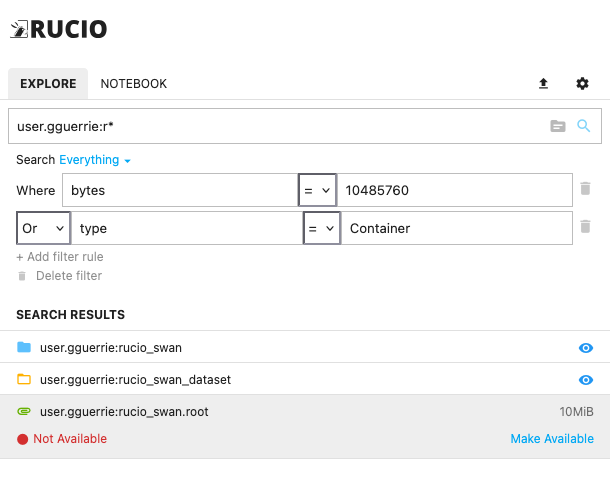
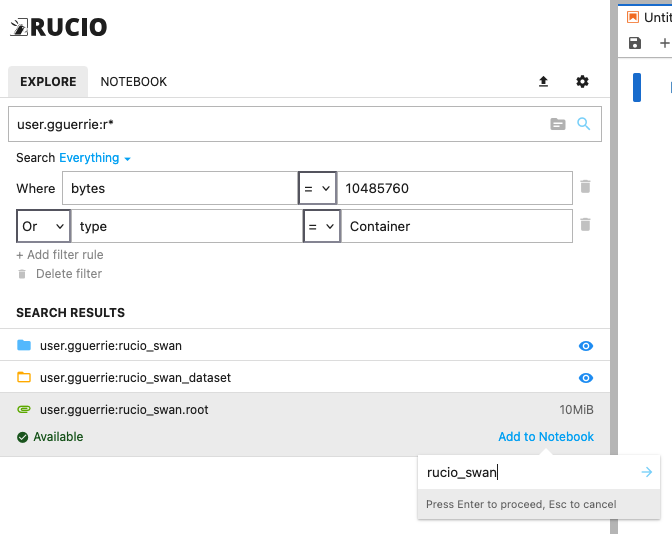

# Browse the Rucio catalog and use datasets

## DISCLAIMER

Please note that the extension configuration is different from the configuration of your terminal. In order to have the `rucio` commands properly working in your user terminal, you need to set up the clients following the instructions from your experiment. See [the ATLAS guide](https://atlassoftwaredocs.web.cern.ch/internal-links/grid-tutorial/rucio-basics/) as an example.

### Browsing the catalog

The search bar only accepts items that are built according to the `scope:name` format.

To dynamically browse the available scopes for an experiment, click on the folder icon to the right of the search bar. When a scope is selected, the search bar will be pre-filled with that scope.

Entries can be filtered by type (Container, Dataset, File) and by metadata (see the [Rucio database model](https://github.com/rucio/rucio/blob/6d473205cb846c96fbf08b1e9edea7027cc9baa1/lib/rucio/db/sqla/models.py#L405)).

The search method accepts the `*` wildcard, so to list all the elements registered under a scope `example`, you can search for `example:*`.

If one or more of the files are not available on the RSE mounted in the SWAN session, you should execute the command `rucio list-file-replicas <example:test.root>` in your terminal. This should lead to two possible scenarios:

1. The files are replicated in an RSE hosted at CERN: in this case, simply change the SWAN session configuration and set up the RSE that already has the dataset/files replicated.
2. The files are **NOT** replicated in an RSE hosted at CERN: in this case, you should trigger a replication rule by clicking `Make Available`. Please discuss with your conveners which RSE is best to replicate the data to, and mount it in the SWAN session BEFORE triggering the rule.

### Using the data

Once the data becomes available, you can use it directly in a notebook. While a notebook is open in the SWAN session, an `Add to notebook` link should appear in the extension sidebar, as shown in the image below.

After clicking on the link, you can provide a name for the variable that will correspond to the data. After confirmation, this will result in a new variable in the notebook that contains the path to the selected datasets.

