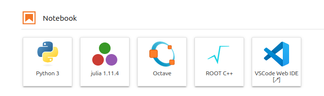

# VS Code integration

SWAN integrates [code-server](https://github.com/coder/code-server) to provide VS Code on the web. 
This gives you a full-featured code editor alongside your Jupyter notebooks, with access to your
CERNBox files and SWAN software stacks.

## Getting started

!!! note
    The VS Code integration is only available when using the [JupyterLab interface](alma9.md).

- Start a new session and make sure to check __Try the new JupyterLab interface (experimental)__.
- Once the session starts, click on __VSCode Web IDE__.

## Integrated terminal

The VS Code integrated terminal defines the same environment variables as the Jupyterlab terminal
so all scripts and commands that work in the Jupyterlab terminal should work in VS Code as well.

## Jupyter notebooks

You can run Jupyter notebooks directly from VS Code, you just need to install the `Jupyter`
extension.

## Import VS Code settings

You can export your existing VS Code settings (`File` -> `Preferences` -> `Settings` ->
`Open Settings (JSON)`) and import them in SWAN using the same command. User settings are stored on
CERNBox so they persist between sessions.

## Differences from Desktop VS Code

While the web version of VS Code works mostly the same, there are some notable differences to be
aware of.

### Extensions

code-server uses [Open VSX](https://open-vsx.org/) instead of the Microsoft's marketplace when
installing extensions. While most popular extensions are available, some other extensions might
not. Note that just like user settings, installed extensions are stored on CERNBox so they persist
between sessions.

### Keybindings

Some VS Code keybindings interfere with browser keybindings. For example `CTRL-N`/`CTRL-W` to
open/close a new editor tab will open/close a browser tab instead. You might wish to rebind these
to something else.
